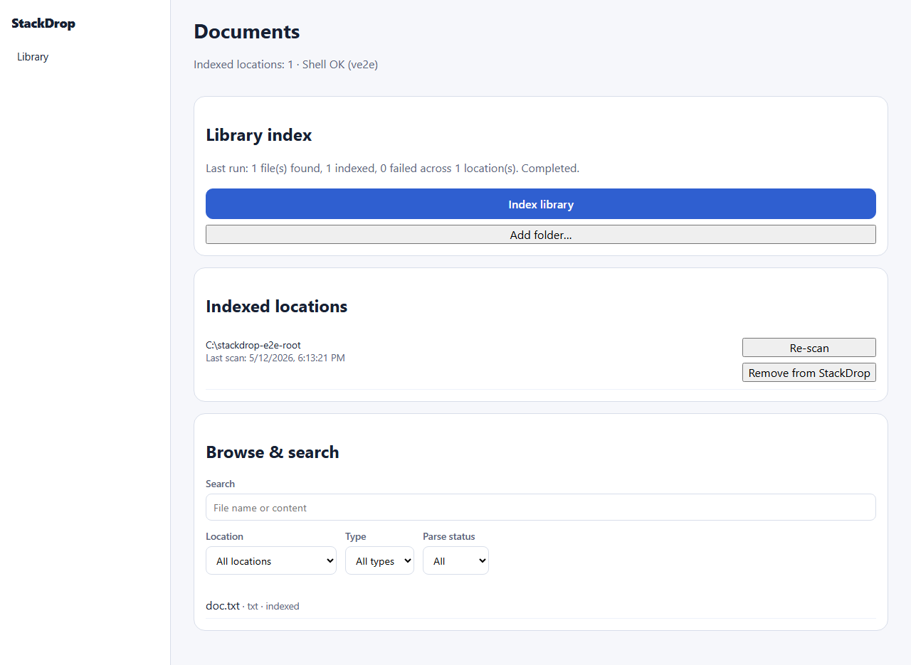
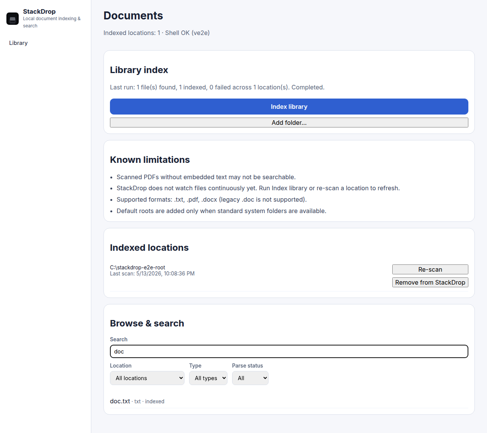
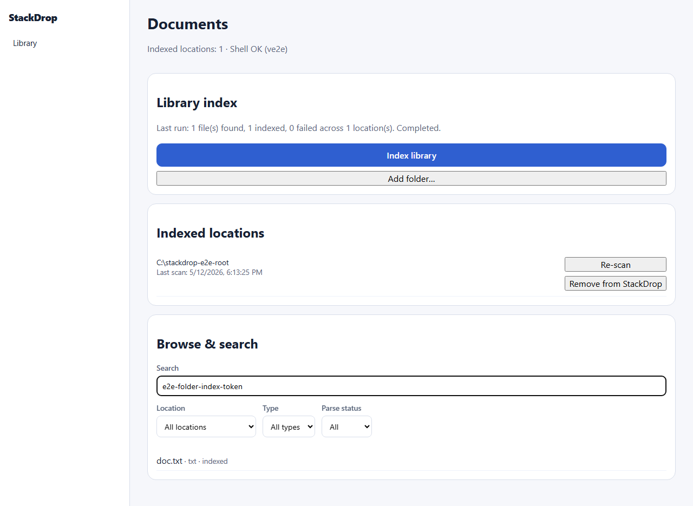
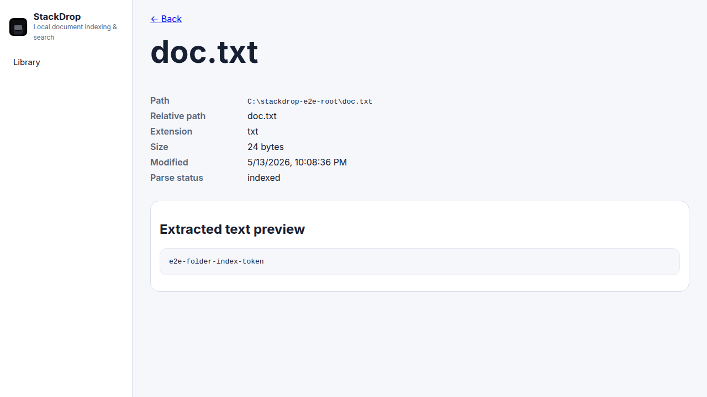

# StackDrop

## What this is

StackDrop is a **Windows / macOS / Linux desktop app** (Tauri + React) that **indexes supported documents under folders you choose** and lets you **search by file name and extracted text**. There is **no cloud account**, **no remote API**, and **no AI**; everything stays on your machine in a local SQLite database with FTS5 full-text search.

## Problem it solves

Personal documents spread across **Documents**, **Desktop**, **Downloads**, and other folders are hard to search consistently with Explorer/Finder alone. StackDrop gives **one “Index library” action** to refresh the index from your registered locations, then **fast unified search** with filters and a **detail view** (path, metadata, parse status, text preview).

## Screenshots

There is **no hosted live demo** (desktop-only). Below are proof screenshots from the automated UI checks.

### Library after Index library



### Search by title or filename



### Search hit on body text



### Document detail (path, preview, parse status)



## Install

### Windows (one-click from GitHub Releases)

Installers are built with Tauri and uploaded as release assets. After you publish [release v0.1.0](https://github.com/ChimdumebiNebolisa/StackDrop/releases/tag/v0.1.0) with the bundle outputs, use these direct downloads (same filenames as `npm run tauri -- build` on Windows x64):

| Installer | Download |
|-----------|----------|
| **NSIS setup (recommended)** | [StackDrop_0.1.0_x64-setup.exe](https://github.com/ChimdumebiNebolisa/StackDrop/releases/download/v0.1.0/StackDrop_0.1.0_x64-setup.exe) |
| **WiX MSI** | [StackDrop_0.1.0_x64_en-US.msi](https://github.com/ChimdumebiNebolisa/StackDrop/releases/download/v0.1.0/StackDrop_0.1.0_x64_en-US.msi) |

[All releases](https://github.com/ChimdumebiNebolisa/StackDrop/releases)

**Signing:** Release builds are **not code-signed** by default. SmartScreen may warn until you sign with a trusted certificate or reputation builds.

### Build from source (Windows, macOS, Linux)

```bash
npm install
npm run tauri -- build
```

`tauri build` runs `beforeBuildCommand` (the web build). On **Windows x64**, artifacts land under `src-tauri/target/release/bundle/` (version comes from `src-tauri/tauri.conf.json` and `src-tauri/Cargo.toml`, currently **0.1.0**):

| Artifact | Relative path |
|----------|----------------|
| NSIS installer | `src-tauri/target/release/bundle/nsis/StackDrop_0.1.0_x64-setup.exe` |
| WiX MSI | `src-tauri/target/release/bundle/msi/StackDrop_0.1.0_x64_en-US.msi` |
| Unsigned app binary | `src-tauri/target/release/stackdrop.exe` |

The `target/` tree is not committed; build locally or in CI. Bump `version` in both Tauri config and `Cargo.toml` when you cut a new release.

## Features

- **Index library:** scan all registered roots for supported files; parse and upsert into SQLite + FTS5.
- **Default safe roots:** seeds Documents, Desktop, Downloads when present; **add folders** via the OS picker; paths stay **under registered roots** (see [`docs/SECURITY.md`](docs/SECURITY.md)).
- **Search:** full-text search with filters (location, type, parse status).
- **Document detail:** absolute path, metadata, parse status, extracted text preview.
- **Explicit parse failures:** failed parses are visible in the UI and are not silently treated as indexed body text.

## Supported file types

| Extension | Indexing |
|-----------|----------|
| `.txt` | Yes |
| `.pdf` | Yes (text layer via pdf.js; no OCR) |
| `.docx` | Yes (via mammoth) |

Legacy **`.doc`**, cloud sync, collaboration, and “index the whole disk” are **out of scope**.

## Tech stack

| Layer | Technology |
|-------|------------|
| Desktop shell | [Tauri 2](https://v2.tauri.app/) (Rust) |
| UI | React 19, React Router, Vite |
| Local database | SQLite (via `@tauri-apps/plugin-sql`) + FTS5 (`sql.js-fts5` in the web/e2e path) |
| PDF / Word parsing | pdf.js, mammoth (in the frontend bundle) |

There is **no** separate HTTP backend, **no** authentication service, and **no** LLM/API integration in this repo.

## Documentation

| Doc | Topic |
|-----|--------|
| [`stackdrop-prd.md`](stackdrop-prd.md) | Canonical product definition (v1.3) |
| [`docs/API.md`](docs/API.md) | Tauri commands + TypeScript services |
| [`docs/DATABASE.md`](docs/DATABASE.md) | Schema, migrations, indexing behavior |
| [`docs/ENV.md`](docs/ENV.md) | Optional env (e.g. E2E shims) |
| [`docs/SECURITY.md`](docs/SECURITY.md) | Capabilities, path safety |
| [`docs/PRODUCTION.md`](docs/PRODUCTION.md) | Logging, health, build notes |
| [`docs/PROOF.md`](docs/PROOF.md) | Verification + architecture summary |

Some older **v1.0 design drafts** under `docs/` (`PRD.md`, `PLAN.md`, `ARCHITECTURE.md`) are **marked superseded** at the top of each file; do not treat them as the shipped product spec.

## Requirements

- **Node.js** 20+
- **Rust** toolchain (stable), for Tauri dev/build
- **OS**: Windows, macOS, or Linux (default folder labels come from the `dirs` crate)

## Setup

### 1. Clone and install

```bash
git clone https://github.com/ChimdumebiNebolisa/StackDrop.git
cd StackDrop
npm install
```

### 2. Environment variables

**Normal desktop use does not require a `.env` file.** Optional variables used for **automated E2E** or local debugging are documented in [`docs/ENV.md`](docs/ENV.md) (e.g. `VITE_E2E_SQLITE`).

## Run

**Full app (recommended):** native file access and real folder defaults:

```bash
npm run dev
```

**Web UI only:** useful for layout work; **no** Tauri shell (folder defaults and disk reads need Tauri or E2E shims):

```bash
npm run dev:web
```

## Testing

```bash
npm run typecheck
npm run test
npm run test:e2e
```

In `src-tauri`:

```bash
cargo test
```

**What this covers:** TypeScript types; Vitest unit/integration on parsing, DB, and services; Playwright smoke flows with `VITE_E2E_SQLITE=1` (see [`playwright.config.ts`](playwright.config.ts)); Rust helpers where tested. There is **no** separate REST API test suite.

## Build (web assets)

```bash
npm run build
```

Produces static files in `dist/` for the Tauri `frontendDist`.

## How it works (short)

1. **Migrations** run on startup; **`indexed_folders`** holds roots. If empty, the app seeds **default document roots** via Tauri when available.
2. **Index library** walks each root (Rust discovery + safe reads), parses in TypeScript, upserts **`indexed_documents`**, updates the **FTS5** index, and prunes missing files.
3. **Search** queries FTS5 and the UI shows hits; opening a row shows **detail** including parse status and preview.

## Repository layout (high level)

| Path | Role |
|------|------|
| `src/` | React UI, routes, features, parsers, DB client |
| `src-tauri/` | Tauri shell, Rust commands, path containment |
| `src/data/db/` | SQL schema + migrations |
| `src/tests/` | Vitest + Playwright |

## Known limitations

- **No OCR:** scanned PDFs without a text layer may fail or yield empty text.
- **No file watcher:** run **Index library** (or re-scan a location) to pick up changes.
- **No legacy `.doc`:** only `.txt`, `.pdf`, `.docx`.
- **Default roots** depend on standard OS profile folders existing.

More detail: [`docs/PROOF.md`](docs/PROOF.md) (Known limitations).

## License

[MIT](LICENSE). See [`LICENSE`](LICENSE) for the full text.
