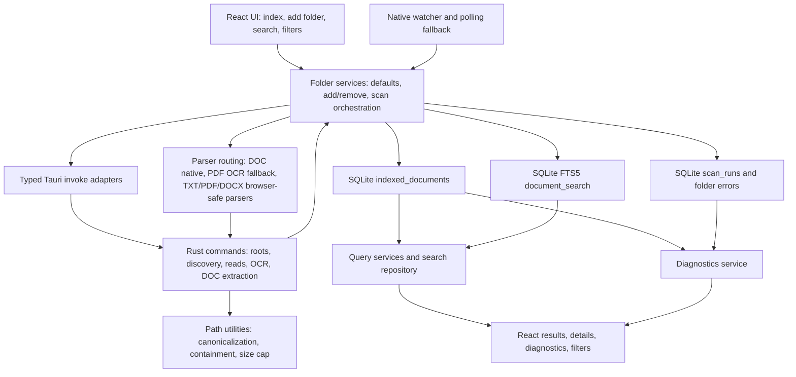

# Producer-to-consumer architecture and blast-radius map

Date: 2026-07-16
Scope: Phase 1.6 trace of the current indexing and search flow from local filesystem producers to React UI consumers.

This document maps active behavior only. It does not claim support for deferred formats or future search semantics.

## End-to-end flow

## Producer and consumer inventory

| System stage | Primary producers | Primary consumers | Current contract |
|--------------|-------------------|-------------------|------------------|
| Root registration | `get_default_document_roots`, `open_folder_dialog`, `ensureDefaultLibraryRoots`, `addIndexedFolder` | `indexed_folders`, scan services, UI location controls | Roots are canonical local directories. Duplicate roots are rejected by SQLite uniqueness and service checks. |
| Filesystem discovery | `discover_supported_files` in `src-tauri/src/commands/file_commands.rs` | `runFolderScan`, watcher signature polling, E2E shims, discovery tests | Returns sorted supported-file DTOs for `txt`, `pdf`, `docx`, and `doc` under one root. Unsupported files are skipped before TypeScript sees them. |
| Filesystem boundary | `src-tauri/src/path_utils.rs` | read, OCR, DOC extraction, folder picker normalization | Canonicalizes paths, strips Windows verbatim prefixes for frontend use, enforces root containment for file reads and native extractors, and caps byte reads at 50 MiB. |
| Watch events | `watchIndexedFolders` plus `@tauri-apps/plugin-fs` and polling signatures | `runFolderScan`, React background indexing state | Supported-extension events trigger rescans. Unknown or extensionless paths also trigger rescans. Unsupported known extensions are ignored by event filtering, while polling sees only discovery output. |
| Read and parse input | `runFolderScan` | `parseDiscoveredFile`, `DocumentRepository`, `DocumentSearchRepository`, scan counters | New, changed, failed, and missing rows are processed. Healthy unchanged rows are skipped by path, size, modified timestamp, and non-failed parse status. |
| Parser dispatch | `parseDiscoveredFile`, `parseFileContent`, native OCR and DOC commands | `indexed_documents`, `document_search`, diagnostics, UI badges | `.doc` uses native legacy extraction. `.txt`, `.pdf`, and `.docx` use browser-safe parsers. Near-empty PDF text attempts OCR. Parse failures are persisted per file and do not cancel the scan. |
| Metadata persistence | `DocumentRepository.upsertDocument`, `deleteDocumentsNotInPaths` | query services, diagnostics, document detail, incremental skip logic | `indexed_documents` stores canonical display metadata, parse status, failure stage/error, extracted text, size, modified timestamp, and update time. Missing files are pruned only after discovery and per-file processing complete. |
| Search index persistence | `DocumentSearchRepository.indexDocument`, `removeDocument` | `searchDocuments`, snippets, result ranking | FTS rows exist only for parsed documents. Read or parse failures remove stale FTS rows while retaining filename/path metadata in `indexed_documents`. |
| Scan run diagnostics | `runFolderScan`, `runAllFolderScans`, `FolderRepository.updateScanError` | `getIndexDiagnostics`, React diagnostics panel | Scan runs record discovered/indexed/failed counters. Root errors and timeouts are retained on folders. Partial scans are inferred from root timeout text plus unprocessed counts. |
| Query and ranking | `queryDocuments`, `DocumentSearchRepository.searchDocuments`, `DocumentRepository.listDocuments` | React result list, grouping, filters, snippets | Non-empty searches use exact FTS, then prefix FTS only if exact returns zero, then filename/path substring fallback. Relevance uses exact filename boost and weighted BM25. Empty searches list metadata rows. |
| UI presentation | `DocumentLibraryScreen`, document detail route | User workflows, diagnostics, proof/e2e tests | UI exposes location, type, parse-status, sort, grouping, density, index controls, background indexing, scan progress, failure details, and snippets. Snippet HTML is restricted to `mark` tags before rendering. |

## Primary data paths

### Manual library indexing

1. `DocumentLibraryScreen` calls `ensureDefaultLibraryRoots`.
2. Default roots come from the Rust command when no folders are registered.
3. `runAllFolderScans` reads registered roots and calls `runFolderScan` sequentially.
4. `runFolderScan` invokes Rust discovery, creates a scan run, prioritizes new/changed/failed files, reads bytes under the root, parses each file, and persists each file result.
5. Successful parses write `indexed_documents` and `document_search`; failed reads or parses write `indexed_documents` with `parse_failed` and remove stale FTS.
6. Missing files are pruned from metadata and FTS at finalization.
7. UI reloads folders, diagnostics, and search results through the data-version bump.

### Background indexing

1. `watchIndexedFolders` starts native recursive watchers and a polling fallback for registered folders.
2. Watch events are filtered against the handwritten supported-extension set.
3. Polling builds a signature from `discover_supported_files`, so it shares the Rust supported-extension gate.
4. A dirty folder triggers `runFolderScan` when no manual or automatic scan is already in flight.
5. UI state records watcher health and surfaces auto-index failures.

### Search and diagnostics

1. `DocumentLibraryScreen` builds filters from location, extension, parse status, and sort controls.
2. `queryDocuments` routes empty search text to metadata listing and non-empty search text to FTS relevance search.
3. `DocumentSearchRepository` applies folder, extension, and parse-status filters in every FTS and fallback query path.
4. `getIndexDiagnostics` aggregates folder-level health, searchable documents, read failures, parser failures, unknown failures, recent failures, root errors, and inferred partial scans.
5. UI renders result rows, snippets, parse badges, diagnostics totals, recent failures, and per-folder retry/remove actions.

## Blast-radius map for roadmap changes

| Change area | Required producers and consumers to inspect | High-risk drift points |
|-------------|---------------------------------------------|------------------------|
| File-type registry or new format | Rust discovery, watcher filtering, `FileExtension`, parser routing, SQLite check constraints, migrations, search filters, UI filter options, diagnostics copy, fixtures, e2e shims, docs | Adding an extension in discovery without updating TS types or SQLite rejects scan persistence. Adding UI filters without backend support creates dead controls. |
| Parser behavior | `parseDiscoveredFile`, `parseFileContent`, native commands, scan failure persistence, FTS sync, diagnostics, fixtures | Parser exceptions must become per-file failures. Empty output behavior must be explicit. Native parser paths must keep root containment checks. |
| Search ranking | `queryDocuments`, `DocumentSearchRepository`, FTS schema, search fixtures, UI snippet rendering, docs | Prefix search currently runs only after exact FTS returns zero. Fallback bypasses FTS and BM25. Any persistent ranking feature needs migration planning. |
| Filters and pagination | domain query types, repository SQL, UI controls, diagnostics links, tests | Every query path must apply the same filters, including empty browse, exact FTS, prefix FTS, and fallback. |
| Scan correctness | discovery, read timeouts, parse timeouts, skip logic, per-file persistence, pruning, scan run finalization, watcher triggers | Root-level discovery failures must not prune existing documents. Per-file failures must not cancel the whole root. Pruning should happen only after a complete discovery and processing pass. |
| Database schema or migrations | `schema.sql`, `migrate.ts`, repositories, tests, database docs, release notes if user-visible | `indexed_documents` and `document_search` can diverge when multi-statement updates are not atomic. FTS column changes require rebuild and repopulation. |
| Filesystem security | `path_utils`, Rust commands, Tauri capabilities, watcher roots, folder add/default-root flows, security docs | All file-content access must resolve under a registered root. Symlink, junction, UNC, and time-of-check/time-of-use behavior need platform-specific verification before claims. |
| Diagnostics | `scan_runs`, folder errors, parse status/failure stage, diagnostics service, UI copy, README | Unsupported files are not tracked today. Partial scan status depends on specific timeout error text and scan counters. |
| Packaging and release | `src-tauri/resources`, Tauri config, release workflow, bundled tools, smoke scripts, README/release docs | Parser tool changes can affect installer size, bundled resources, Windows-only behavior, and release smoke coverage. |

## Boundary rules confirmed by the trace

- StackDrop remains local-first. No scanned document bytes or extracted content leave the local machine in the current architecture.
- The Rust command layer owns recursive discovery and filesystem containment checks; TypeScript services own scan orchestration and persistence.
- The database is not only storage. Its constraints and migrations are active consumers of supported-file and parser-status contracts.
- Search behavior is currently query-time policy over existing metadata and FTS columns. It is not backed by persistent token, normalized-name, parser-version, or rank metadata.
- UI diagnostics are consumers of stored scan state, not a direct view of skipped unsupported files.

## Known unverified platform behavior

- Windows development and tests inspect Windows path strings, but this map does not verify Windows junctions, reparse points, or UNC traversal behavior beyond existing unit coverage.
- Linux and macOS discovery, packaging, and native tool behavior were not exercised for this documentation unit.
- Packaged-app migration from an existing user database was not opened manually during this unit.
- Watcher behavior is represented from source and unit tests, not a long-running filesystem stress test.

## Follow-on implications

- Phase 2 should use this map as the checklist for every consumer of the canonical capability registry.
- Phase 3 format work should complete the full path from discovery through parser, persistence, FTS, filters, diagnostics, fixtures, e2e shims, and documentation before claiming support.
- Phase 5 search work should update this map or the search baseline whenever query paths, ranking contracts, snippets, or fallback behavior change.
- Phase 6 consistency work should decide whether per-document metadata and FTS updates need explicit transaction wrapping.
