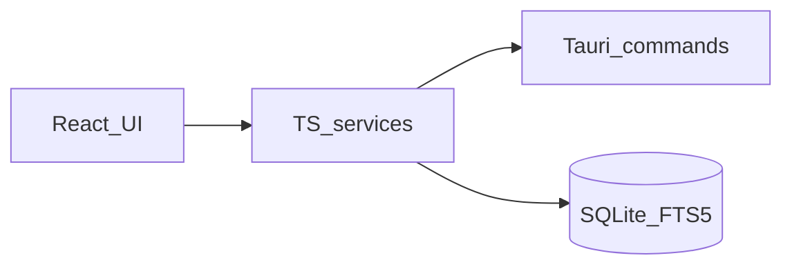

# StackDrop proof and architecture notes

## Architecture (short)



- **UI** drives search and the **Index library** action.
- **Services** orchestrate migrations, default-root seeding, per-root scans (inside SQLite **transactions**), parsing, and repository calls.
- **Tauri** resolves default OS folders, walks trees for discovery, and reads bytes with root containment checks and **non-empty path validation** on commands.
- **SQLite + FTS5** store folders, documents, scan runs, and the searchable index.

## Verification artifacts

| Check | Command / location |
|-------|---------------------|
| Typecheck | `npm run typecheck` |
| Unit + integration | `npm run test` |
| E2E | `npm run test:e2e` |
| Rust | `cargo test` (in `src-tauri`) |
| Build | `npm run build` |
| Fixture | [`src/tests/fixtures/minimal.docx`](../src/tests/fixtures/minimal.docx) (regenerate with `python scripts/write_minimal_docx.py`) |

## Example service usage

```typescript
import type { SqlClient } from "../src/data/db/sqliteClient";
import { ensureDefaultLibraryRoots } from "../src/features/folders/services/ensureDefaultLibraryRoots";
import { runAllFolderScans } from "../src/features/folders/services/runAllFolderScans";

export async function refreshLibrary(client: SqlClient) {
  await ensureDefaultLibraryRoots(client);
  return runAllFolderScans(client);
}
```

## Proof screenshots (automated)

Produced by Playwright when `npm run test:e2e` runs:

| File | Shows |
|------|--------|
| `docs/proof-screenshots/01-library-after-index.png` | Library after **Index library** |
| `docs/proof-screenshots/02-search-by-title.png` | Search narrowed by title token |
| `docs/proof-screenshots/03-search-by-content.png` | Search hit on indexed body text |
| `docs/proof-screenshots/04-document-detail.png` | Detail view (path, preview) |

## Known limitations

- **Scanned PDFs** without a text layer may fail extraction or yield empty text (no OCR in v1).
- **No continuous file watcher** — user must run **Index library** (or per-location **Re-scan**) to refresh.
- **Default roots** require the OS-standard folders to exist; unusual profiles may get fewer than three seeds.
- **`npm run dev:web`** does not load the Tauri shell; defaults and disk reads require **Tauri** or **e2e shims** (`VITE_E2E_SQLITE`).

## Next improvements

- Incremental indexing / watcher mode (PRD change required).
- Snippet/highlight in search results; code-split mammoth/pdf worker to shrink bundle.
