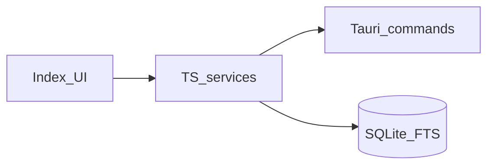

# StackDrop Architecture

Version: v1.3 (core document types)
Status: Locked for v1 build
Date: 2026-05-12

## 1. Architecture goal

Define boundaries for a **local-first**, **single-user** desktop app that:

1. Registers **search roots** (default user-document locations plus optional user-added folders).
2. **Indexes** supported documents under those roots only.
3. **Persists** index state in **SQLite + FTS5**.
4. **Searches** by name and content with typed filters.

No accounts, no remote services, no implicit full-disk indexing.

## 2. Major system parts

### 2.1 Desktop shell (Tauri)

**Ownership**

- Window lifecycle.
- Folder picker.
- **Default document root resolution** (canonical paths for Documents / Desktop / Downloads via OS-appropriate APIs).
- **Optional:** `app_health` (or similarly named) command returning **structured JSON** for shell-side diagnostics (version, basic readiness). **Not** an HTTP server.
- Recursive filesystem discovery for **allowed extensions** under a **validated** root.
- Safe byte reads with **root containment** checks (`path_utils`).

**Does not own**

- SQLite business rules beyond what commands require for IO.
- FTS ranking policy beyond SQLite defaults.

### 2.2 UI (React + TypeScript)

**Ownership**

- Primary **Index library** action, search UI, filters, detail screens, scan status presentation.

**Does not own**

- Recursive disk walks outside services.
- Direct SQL from presentational components.

### 2.3 Application services (TypeScript)

**Ownership**

- **`ensureDefaultLibraryRoots(client)`** — if no folders registered, insert default roots from shell command.
- **`runAllFolderScans(client)`** — orchestrate `runFolderScan` for each root sequentially; aggregate counts for UI.
- **`runFolderScan(folderId, client)`** — existing per-root pipeline: discover → read → parse → persist → FTS sync → prune missing paths.
- Search, list, detail, folder CRUD, validation.

**Does not own**

- OS path canonicalization (delegates to Tauri).

### 2.4 Parsing layer (TypeScript)

**Ownership**

- **`.txt`**, **`.pdf`**, **`.docx`** (e.g. **mammoth** for `.docx` → plain text).
- Explicit **parse result** types; no swallowed failures on the public API.

**Does not own**

- Filesystem traversal.
- Persistence.

### 2.5 Persistence (SQLite + FTS5)

**Ownership**

- Tables: `indexed_folders`, `indexed_documents`, `document_search` (FTS5), `scan_runs`.
- Migrations for schema evolution (canonical extension set `txt` \| `pdf` \| `docx`).
- Parameterized search (`MATCH` + bound parameters after query normalization).

## 3. Interfaces (“API” for this desktop app)

There is **no** required HTTP backend. Contracts are:

### Tauri commands (Rust → TS)

Illustrative names (see code for exact identifiers):

| Command | Role |
|--------|------|
| `open_folder_dialog` | Optional folder picker |
| `get_default_document_roots` | Returns canonical default root paths + labels |
| `discover_supported_files` | Lists supported files under one root |
| `read_file_bytes_under_root` | Reads file bytes if path is under root |
| `app_health` | JSON status: shell alive, package version, etc. |

### TypeScript services

| Function | Role |
|----------|------|
| `ensureDefaultLibraryRoots(client)` | Seed defaults when registry empty |
| `runAllFolderScans(client)` | One-click scan all roots |
| `runFolderScan(folderId, client)` | Single-root scan |
| `listIndexedFolders`, `addIndexedFolder`, `removeIndexedFolder` | Root registry |
| `queryDocuments`, `getDocumentDetail` | Read models + search |

**Rule:** UI calls services only; services own validation and orchestration.

### Example usage (documentation contract)

```typescript
import type { SqlClient } from "./data/db/sqliteClient";
import { ensureDefaultLibraryRoots } from "./features/folders/services/ensureDefaultLibraryRoots";
import { runAllFolderScans } from "./features/folders/services/runAllFolderScans";

export async function indexEntireLibrary(client: SqlClient): Promise<void> {
  await ensureDefaultLibraryRoots(client);
  await runAllFolderScans(client);
}
```

```typescript
import { invoke } from "@tauri-apps/api/core";

const health = await invoke<{ ok: boolean; packageVersion: string }>("app_health");
```

## 4. Core entities

### IndexedFolder

- `id`, `rootPath` (unique), `createdAt`, `lastScanAt`

### IndexedDocument

- `id`, `folderId`, paths, `fileName`, `fileExtension` (`txt` \| `pdf` \| `docx`), size, modified time, `parseStatus`, `parseError`, `extractedText`, `updatedAt`

### ScanRun

- Per-folder run record with timestamps and file counters.

### SearchQuery / SearchResult

- Query: text + optional folder / extension / parse status + sort.
- Result: document fields + relevance/recent ordering from FTS/list layer.

## 5. Data ownership rules

- **Folders** define allowed filesystem scope.
- **Documents** + **FTS** stay consistent on upsert/delete; tombstones for deleted files removed on successful scan via path set reconciliation (existing behavior).

## 6. External dependencies (allowed)

- Tauri v2, React, TypeScript, Vite
- `tauri-plugin-sql`, SQLite FTS5
- `pdfjs-dist`, **mammoth** (`.docx`)
- Vitest, Playwright

## 7. Folder / file layout (target)

```text
src/features/folders/services/   # roots, scan orchestration, Tauri adapters
src/features/documents/
src/domain/ingestion/
src/data/db/                     # schema.sql, migrate.ts
src-tauri/src/commands/
```

## 8. Boundary rules

- No remote backend without PRD + Architecture update.
- No SQL or `invoke` scattered in UI; use services and thin adapters.

## 9. Health / diagnostics

- **`app_health`**: lightweight **Tauri** command (structured JSON). Optional TS helper may combine DB stats (folder count, last scan) for richer in-app diagnostics — still **no** fake HTTP health endpoint.

## 10. Diagram (high level)


